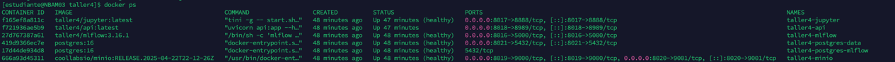
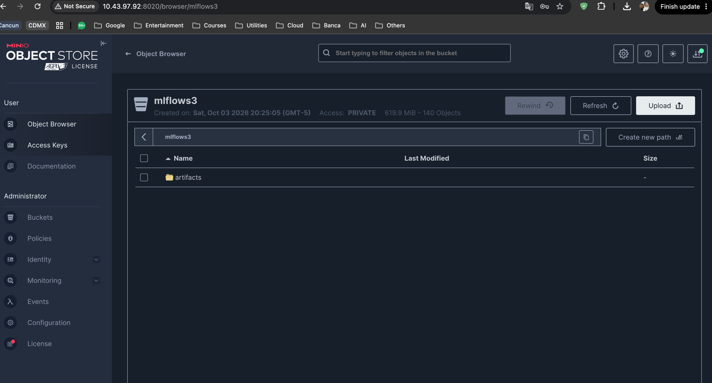
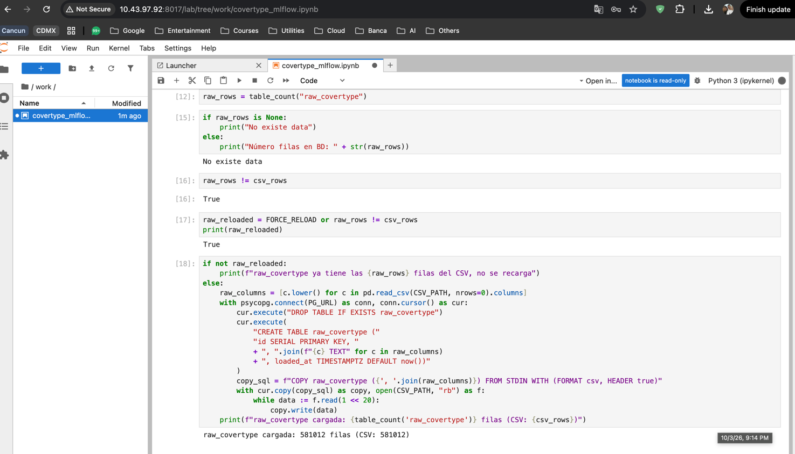
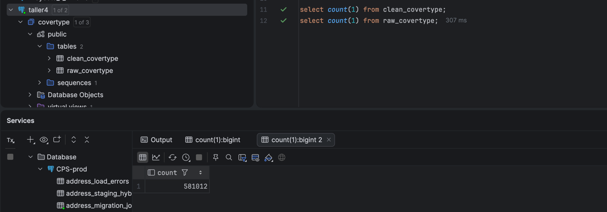
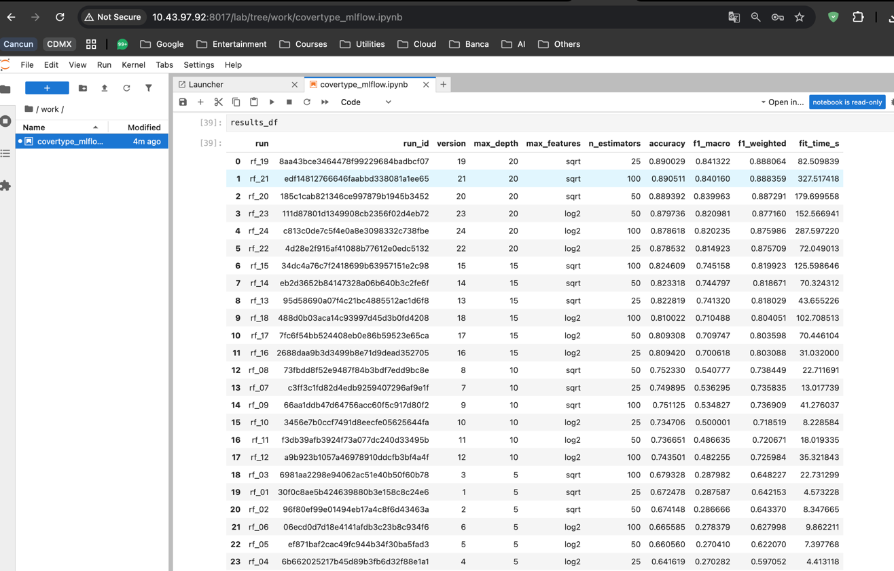
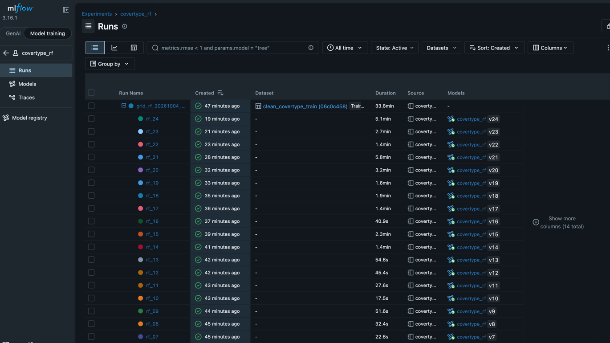
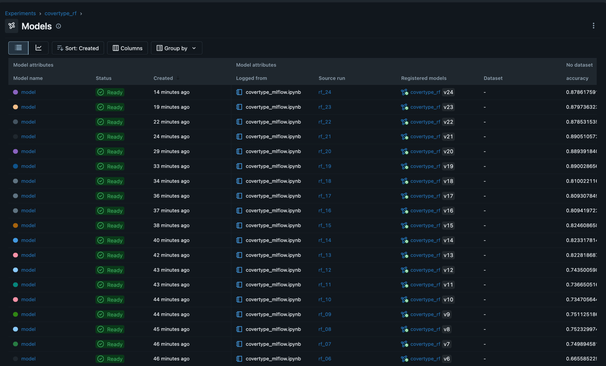
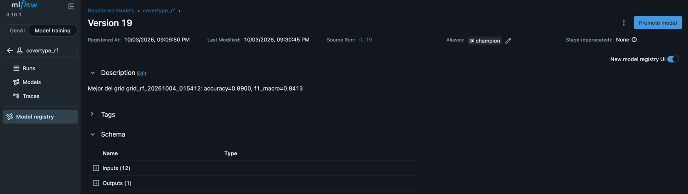
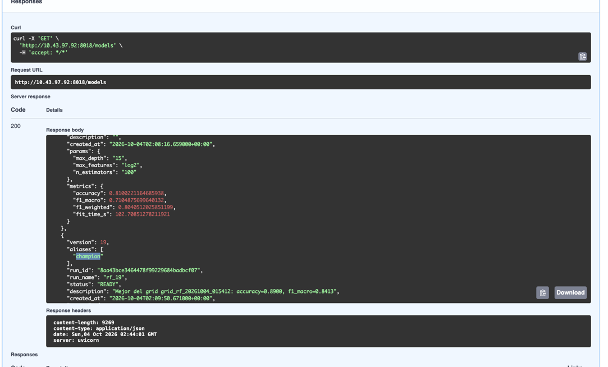
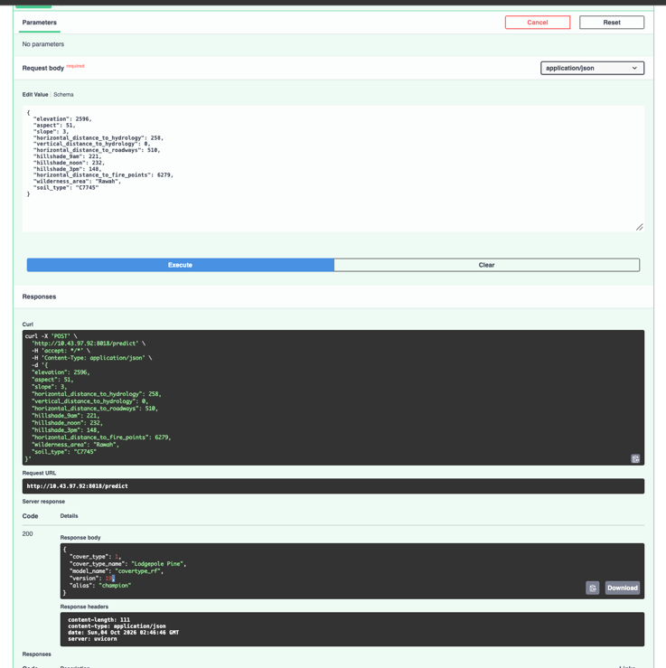

# Taller 4 - MLflow

Entorno con Docker Compose para experimentar con modelos, registrar todo en
**MLflow** y servir el mejor modelo desde una API que lo toma **mediante
MLflow y FastAPI**. Se usa el dataset **Covertype** (tipo de cobertura forestal, 7 clases).

## Estructura

Cada carpeta es un servicio independiente con su `docker-compose.yml` y su
README. El `docker-compose.yml` de esta carpeta (root) los une en un solo proyecto con
`include`.

### Dos instancias de Postgres

- **`postgres-mlflow`** (en `mlflow/`): solo la metadata de MLflow
  (experimentos, runs, parámetros, métricas, Model Registry). No publica puerto.
- **`postgres-data`** (en `database/`, puerto 8021): los datos del taller, en la
  base `covertype`.

## Servicios y puertos

El stack se despliega en la máquina virtual **10.43.97.92**. Usa los puertos
8016-8021.

| Servicio           | Puerto host | URL                                           | Credenciales               |
|--------------------|-------------|-----------------------------------------------|----------------------------|
| UI de MLflow       | 8016        | http://10.43.97.92:8016                       | -                          |
| JupyterLab         | 8017        | http://10.43.97.92:8017                       | token `admin123`           |
| API de inferencia  | 8018        | http://10.43.97.92:8018/docs                  | -                          |
| MinIO (API S3)     | 8019        | http://10.43.97.92:8019                       | `admin` / `admin123`       |
| Consola de MinIO   | 8020        | http://10.43.97.92:8020                       | `admin` / `admin123`       |
| Postgres de datos  | 8021        | `psql -h 10.43.97.92 -p 8021 -U covertype -d covertype` | `covertype` / `covertype123` |

## Cómo levantarlo

Siempre desde esta carpeta:

```bash
cd taller4
docker compose up -d --build
```

## Pruebas de funcionamiento

### 1. Servicios arriba

Los seis contenedores de `taller4` corriendo en el servidor con sus puertos 8016-8021.



### 2. Bucket de MinIO

El bucket `mlflows3` con la carpeta `artifacts`, donde MLflow guarda los modelos.



### 3. Carga de datos crudos

El notebook detecta que `raw_covertype` no existe y carga las 581.012 filas del CSV.



### 4. Datos en Postgres

Las tablas `raw_covertype` y `clean_covertype` en la base `covertype`, consultadas desde un cliente externo por el puerto 8021.



### 5. Resultados de los 24 experimentos

Tabla de resultados ordenada por `f1_macro`. El mejor es `rf_19` (`max_depth=20`, `sqrt`, 25 árboles) con accuracy 0.890 y f1_macro 0.841.



### 6. Experimento en MLflow

El run padre `grid_rf_...` con su dataset y los 24 runs anidados, cada uno ligado a su versión de `covertype_rf`.



### 7. Modelos por run

Cada run registra su modelo como una versión de `covertype_rf` (v1 a v24) con sus métricas.



### 8. Alias `champion`

La versión 19 en el Model Registry con el alias `champion` y la descripción que pone el notebook.



### 9. API: `GET /models`

La API lista las versiones desde MLflow; la 19 aparece con el alias `champion`.



### 10. API: `POST /predict`

Predicción sin indicar versión: la API usa el `champion` (v19) y responde `Lodgepole Pine`.


