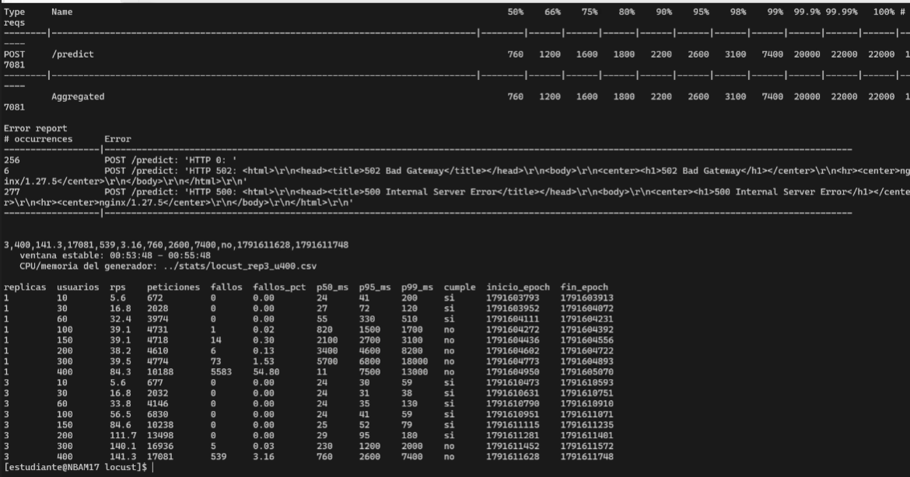
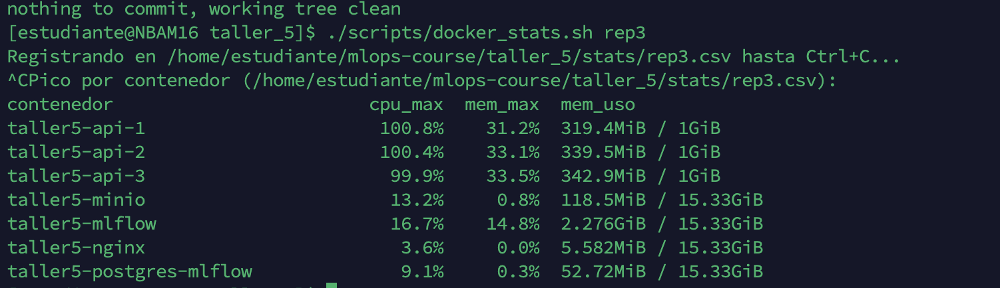
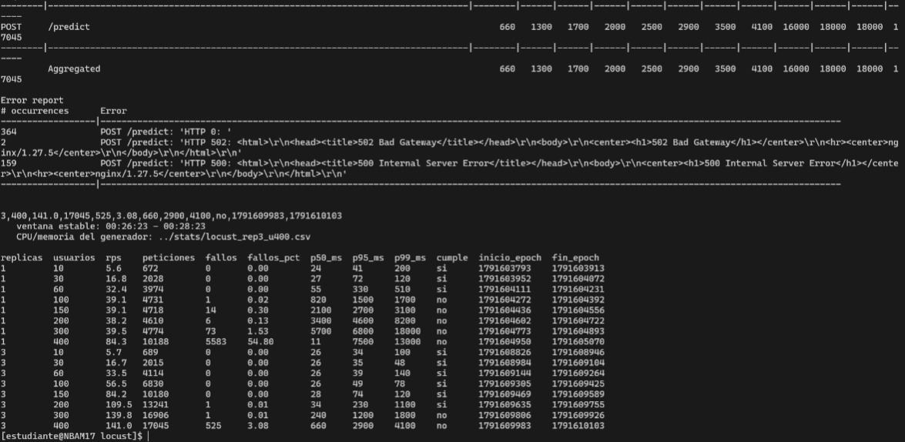
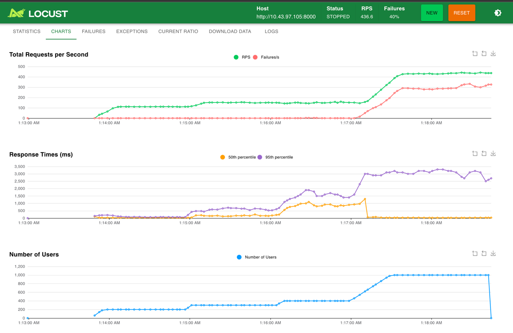
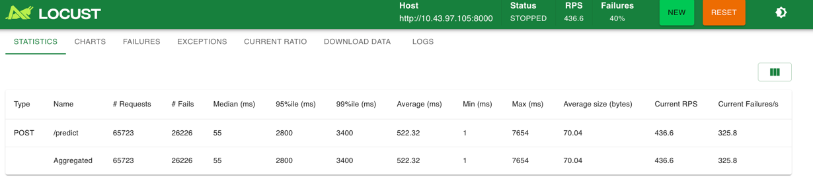
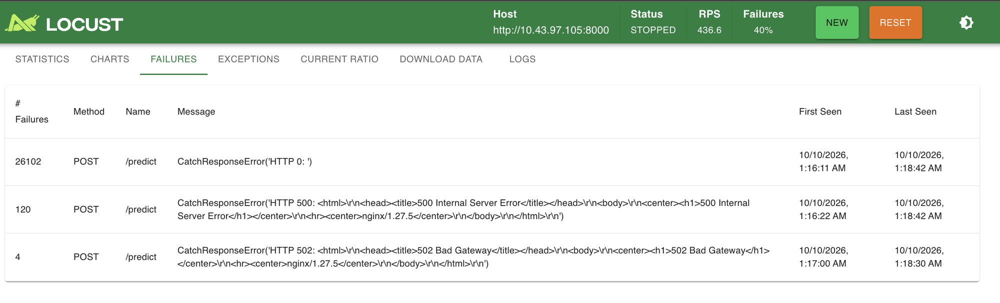
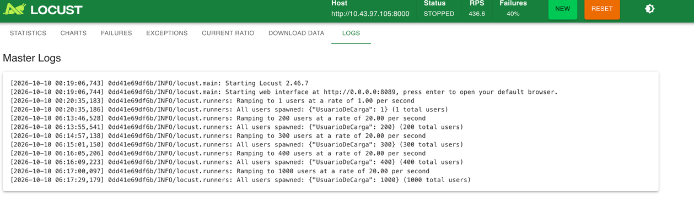
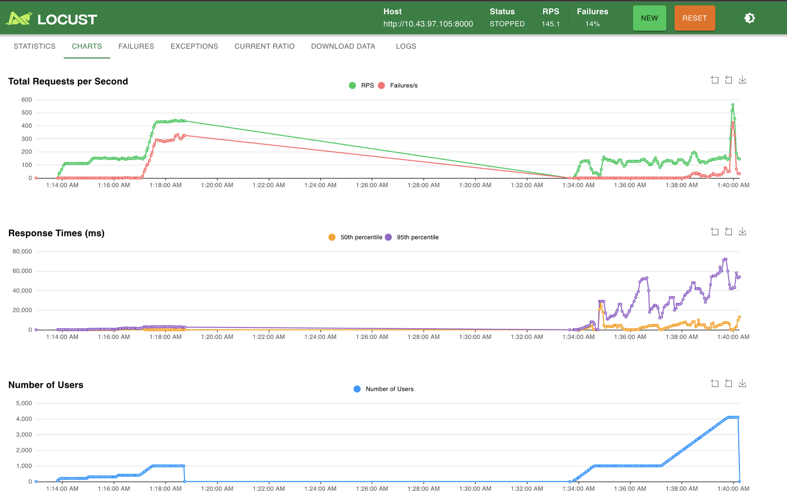
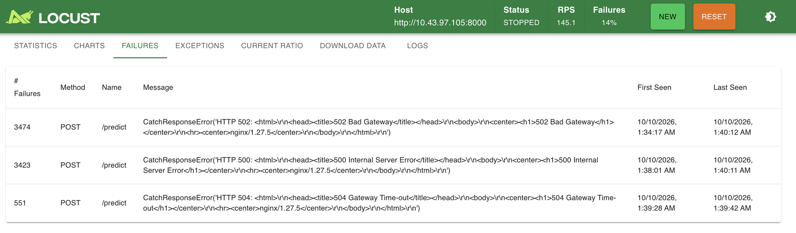

# Taller 5 - Pruebas de carga con Locust

Prueba de carga a una API de inferencia que sirve un modelo cargado desde
**MLflow**, para medir cuántos usuarios concurrentes soporta **una réplica**
limitada a **1 CPU y 1 GB** y cuánto cambia la capacidad con **tres réplicas**
detrás de **Nginx**. Se usa el dataset **Covertype** de taller4.

## Arquitectura

La API y todo lo que necesita corren en una VM; Locust corre en **otra VM**, así
la CPU que se gasta simulando usuarios no compite con la de la API.

 

Flujo:

1. `trainer` entrena dos Random Forest de Covertype, los registra en MLflow como
   versiones de `covertype_rf` y le pone el alias `champion` al mejor.
2. Cada réplica de la `api` descarga el `champion` **al arrancar** y lo deja en
   memoria. Durante la prueba `/predict` no llama a MLflow.
3. Nginx es la única entrada pública y reparte las peticiones entre réplicas.
4. Locust, desde la VM `.106`, genera la carga contra `http://10.43.97.105:8000`.

## Estructura

Cada carpeta es un servicio con su `docker-compose.yml` y su README. 
El `docker-compose.yml` de la raíz los une con `include`. 
Locust tiene su propio compose porque se ejecuta en otra VM.

## Paso a paso

### 1. Construir y publicar la imagen de la API en Docker Hub

```bash
docker login
docker buildx build --platform linux/amd64,linux/arm64 \
  -t crissebasbol/taller5-api:1.0.0 \
  -t crissebasbol/taller5-api:latest \
  --push api
```

En la siguiend imagen se ve la publicación en Docker Hub, con la etiqueta `1.0.0` y `latest`.


### 2. Levantar el stack con una réplica

```bash
cd taller_5
docker compose up -d --build --scale api=1
```

La primera vez el `trainer` tarda un par de minutos entrenando.

En la siguiente imagen se ve que la réplica `taller5-api-1` está `healthy`,
trainer se demoró un par de minutos y Nginx ya está listo para recibir peticiones.


### 3. Verificar que todo funciona

Modelo registrado en MLflow (http://10.43.97.105:8004):

A continuación se ve la interfaz web de MLflow mostrando las dos versiones del modelo `covertype_rf`


Versiones registradas, a través de la API:

```bash
curl http://10.43.97.105:8000/models
```

Llamando a este endpoint se obtiene un JSON con las dos versiones del modelo `covertype_rf`, sus métricas y cuál tiene el alias `champion`.
En la siguiente imagen se ve la salida de `GET /models` mostrando las dos versiones, sus métricas y cuál tiene el alias `champion`.


De igual manera si se llama al endpoint de predict usando nginx se obtiene un JSON con el `cover_type` predicho, la `version` del modelo y la `replica` que atendió la petición.


Límites aplicados a la réplica

```bash
docker inspect taller5-api-1 --format 'cpus={{.HostConfig.NanoCpus}} mem={{.HostConfig.Memory}}'
```


### 4. Preparar Locust

Comprobación de que la API responde

```bash
curl http://10.43.97.105:8000/health
```

Construir la imagen de Locust:

```bash
cd mlops-course/taller_5/locust
docker compose build
```
Para observar la UI de Locust:
```bash
docker compose up
```
En la siguiente imagen se ve la interfaz web de Locust mostrando los campos para configurar la prueba de carga, incluyendo el número de usuarios, la tasa de aparición y el host de la API.


### 5. Prueba con 1 réplica

Se usan dos terminales, una en cada VM, durante **toda** la sesión de pruebas:

- **VM (API):** `scripts/docker_stats.sh` toma una muestra de
  `docker stats` cada 2 s con su hora, y sigue hasta Ctrl+C.
- **VM (Locust):** `run_levels.sh` corre todos los niveles seguidos y
  anota en `resumen.csv` la hora de inicio y fin de la ventana estable de cada uno.

Al final, `scripts/stats_por_nivel.sh` cruza los dos archivos por hora y calcula
la CPU y la memoria de cada contenedor **solo dentro de la ventana de cada
nivel**. Así no hay que lanzar ni detener nada a mano entre niveles.

```text
(LOCUS)  run_levels.sh   |rampa|--- 10 usuarios ---|pausa|rampa|--- 30 ----|pausa| ...
(API)    docker_stats.sh  ·  ·  ·  ·  ·  ·  ·  ·  ·  ·  ·  ·  ·  ·  ·  ·  ·  ·  ·  ...  (Ctrl+C)
                              └ ventana 1 ┘                └ ventana 2 ┘
```

**1. VM (API): Empezar a registrar:***

```bash
./scripts/docker_stats.sh rep1
```

Guarda las muestras en `stats/rep1.csv` y se deja corriendo.

**2. VM (Locust): lanzar los niveles**:

```bash
./run_levels.sh 1 10 30 60 100 150 200 300 400
```

Se usan **los mismos niveles en la prueba de 1 y de 3 réplicas**, para poder
comparar nivel por nivel. La lista cubre las dos zonas donde se espera el límite:
una réplica atiende unos 39 RPS (unos 60-80 usuarios con `wait_time` de 1 a
2.5 s) y tres réplicas unos 117 RPS (unos 200 usuarios). Los niveles más altos
muestran la saturación de cada configuración.

| Nivel | Rampa (20 usuarios/s) | Ventana medida | Pausa |
|---:|---:|---:|---:|
| 10 | 1 s | 120 s | 30 s |
| 30 | 2 s | 120 s | 30 s |
| 60 | 3 s | 120 s | 30 s |
| 100 | 5 s | 120 s | 30 s |
| 150 | 8 s | 120 s | 30 s |
| 200 | 10 s | 120 s | 30 s |
| 300 | 15 s | 120 s | 30 s |
| 400 | 20 s | 120 s | 30 s |

En total tarda unos 21 minutos. Si ya existe un `resumen.csv` de una versión
anterior del script (sin `inicio_epoch` ni `fin_epoch`), `run_levels.sh` se
detiene y pide moverlo o borrarlo.


**3. VM (API): detener el registro** con Ctrl+C cuando `run_levels.sh` termine.

**4. Cruzar por nivel.** Subir `resumen.csv` de la VM (Locust) a la VM (API) a github y
en la VM (API).

Muestra una fila por nivel y por contenedor y la guarda en
`stats/rep1_por_nivel.csv`:

Ya que estamos realizando un script para obtener métricas automatizadas, el reloj debe ser el mismo en ambas máquinas.
Si los relojes no coincidían, `OFFSET` es la diferencia en segundos

```bash
OFFSET=0 ./scripts/stats_por_nivel.sh stats/rep1.csv locust/resultados/resumen.csv
```

Salida final de `run_levels.sh` con 1 réplica (VM Locust). Desde 100 usuarios el
RPS se queda en ~39 y el p95 se dispara. En 400 aparecen los `500` de Nginx:


Pico de toda la sesión al detener `docker_stats.sh` (VM API). `taller5-api-1`
llega a 104 % de CPU (1 CPU completa) con solo 317 MiB de memoria:


Log de Nginx durante los niveles de 300 y 400 usuarios: se quedó sin conexiones
con su límite por defecto de 512:


El detalle por nivel (salida de `stats_por_nivel.sh`, en
`stats/rep1_por_nivel.csv`) está en [Resultados](#1-réplica-1-cpu-1-gb).

### 6. Escalar a 3 réplicas

Las dos pruebas se corren con la misma configuración de Nginx, la que viene por
defecto: 1 proceso con 512 conexiones (ver [nginx/README.md](nginx/README.md)).
Ese límite aparece en los niveles más altos de las dos pruebas (ver Resultados).

Se prosigue incrementando el número de réplicas a 3:

```bash
docker compose up -d --scale api=3
docker compose ps api
```

Es importante comprobar que las tres instancias estén respondiendo:


### 7. Prueba con 3 réplicas

Mismo procedimiento del paso 5, mismo `locustfile.py`, misma tasa de aparición,
misma ventana y mismo criterio. Solo cambian el nombre del registro y el primer
argumento de `run_levels.sh`:

```bash
./scripts/docker_stats.sh rep3
./run_levels.sh 3 10 30 60 100 150 200 300 400
```

`resumen.csv` tiene ahora filas de 1 y de 3 réplicas. 

Salida final de `run_levels.sh`. La tabla incluye las dos pruebas.
Con 3 réplicas el RPS sigue a la demanda hasta 200 usuarios (111.7 RPS, p95 de
95 ms) y se estanca en ~141 RPS desde 300:



Pico de toda la sesión al detener `docker_stats.sh` (VM API). Las tres réplicas
llegan a ~100 % de CPU con ~340 MiB de memoria cada una:



Una primera corrida de 3 réplicas (en la que se perdió la terminal de
`docker_stats.sh`, por eso no tiene CPU por nivel) dio prácticamente los mismos
números: 200 usuarios → 109.5 RPS y p95 de 230 ms; 300 → 139.8 RPS y p95 de
1200 ms; 400 → 141.0 RPS con 3.08 % de fallos. Es decir, el resultado se repite:



#### Visualización del límite en la UI de Locust

Las mediciones oficiales se corrieron en modo headless, que no genera gráficas.
Para ver el límite de 3 réplicas en una sola imagen se hizo una prueba aparte
desde la UI (http://10.43.97.106:8006), con la misma tasa de aparición (20
usuarios/s). Mientras corría, se subieron los usuarios más o menos cada minuto:
**200 → 300 → 400 → 1000**.



Qué muestra cada tramo:

| Tramo (hora local) | Usuarios | RPS total | Fallos/s | p50 | p95 | Lectura |
|---|---:|---:|---:|---:|---:|---|
| 1:14 - 1:15 | 200 | ~112 | 0 | < 50 ms | ~100-200 ms | Dentro de la capacidad |
| 1:15 - 1:16 | 300 | ~150 | 0 | ~200 ms | ~500-700 ms | Llega al techo: el RPS casi no sube |
| 1:16 - 1:17 | 400 | ~150 | ~0 | ~800-1000 ms | ~1500-1900 ms | Mismo RPS, más fila |
| 1:17 - 1:18 | 1000 | ~435 | ~290-330 | **~50 ms** | ~3000 ms | Más de la mitad de las respuestas son fallos inmediatos |

**Por qué el p50 baja al subir a 1000 usuarios.** No es que la API responda más
rápido: lo que pasa es que la mayoría de las respuestas ahora son **fallos que
llegan de inmediato**. Locust calcula los percentiles con todas las peticiones,
tanto las que funcionan como las que fallan:

- **Fallos:** casi todos son `HTTP 0`, es decir, Locust no recibió ninguna
  respuesta HTTP (conexión rechazada o cortada). 
- **Peticiones que funcionan:** siguen esperando en la fila de las réplicas
  ~3 s. Eso es lo que muestra el p95 (~3000 ms).

Las respuestas exitosas siguen siendo ~135-150 por segundo, el mismo techo de 300 y 400 usuarios. Lo que se
suma son errores rápidos, que dejan al usuario libre para mandar la siguiente
petición antes. Por eso **el RPS y el p50 solo se pueden leer junto con el
porcentaje de fallos**: con 40 % de fallos, un RPS alto y un p50 bajo indican que
el sistema está rechazando carga, no que la esté atendiendo.

Estadísticas acumuladas de toda la prueba:



**Fallos**:

26102 `HTTP 0` (99.5 %), 120 `500` de Nginx y 4 `502`. Los primeros
aparecen a la 1:16:11, poco después de pasar a 400 usuarios, y se disparan con
1000:



Logs de Locust con cada cambio de usuarios (en UTC: 06:13 = 1:13 hora local):



**Quién rechaza las conexiones: Nginx.** En esa ventana (06:16 a 06:19 UTC) el
log de Nginx está lleno de este error, hacia las tres réplicas
(`172.20.0.5`, `.6` y `.8`):

```text
$ docker logs --since 2026-10-10T06:16:00Z --until 2026-10-10T06:19:00Z taller5-nginx 2>&1 \
    | grep -E "\[(alert|crit|error|emerg)\]" | head -5
2026/10/10 06:16:22 [alert] 22#22: *43993 512 worker_connections are not enough while connecting to upstream, client: 10.43.97.106, ..., upstream: "http://172.20.0.8:8989/predict"
2026/10/10 06:16:22 [alert] 22#22: *43994 512 worker_connections are not enough while connecting to upstream, client: 10.43.97.106, ..., upstream: "http://172.20.0.5:8989/predict"
2026/10/10 06:16:22 [alert] 22#22: *44000 512 worker_connections are not enough while connecting to upstream, client: 10.43.97.106, ..., upstream: "http://172.20.0.6:8989/predict"
...
```

Coincide con lo que muestra Locust:

- **Empiezan con 400 usuarios.** La primera alerta es de las 06:16:22, a los
  pocos segundos de pasar a 400 usuarios (06:16:09). Es el mismo minuto en que
  aparecen los primeros fallos en la UI (1:16:11 y 1:16:22 hora local).
- **Explica los `500`.** Nginx ya aceptó la petición de Locust, pero no tiene
  conexión libre para pasarla a una réplica.
- **Explica los `HTTP 0`.** Con las 512 conexiones ocupadas, Nginx tampoco acepta
  conexiones nuevas de Locust, y Locust no recibe ninguna respuesta. Con 1000
  usuarios es lo que pasa en la mayoría de las peticiones.

Es decir, con 3 réplicas y más de ~400 usuarios lo que se mide es el límite de
512 conexiones de Nginx, no el de las réplicas.

Las series en el tiempo de las pruebas oficiales (sin gráfica) quedan en
`locust/resultados/rep<N>_u<usuarios>_stats_history.csv`.

#### Prueba adicional: Nginx con 4096 conexiones

Para ver qué pasa sin el límite de 512 conexiones, se hizo una prueba adicional
con 3 réplicas y la configuración de [`nginx/nginx.conf`](nginx/nginx.conf):

```nginx
worker_processes auto;          # un proceso de Nginx por núcleo
events {
    worker_connections 4096;    # conexiones por proceso
}
```

Se reinició Nginx (`docker compose restart proxy`) para que cargara esa
configuración. En los resultados se ve
que tomó efecto: con 1000 usuarios ya no aparecen los fallos de conexión que sí
aparecían con 512. La prueba se hizo desde la UI de Locust, con la misma tasa de
aparición (20 usuarios/s):

- **1000 usuarios** durante unos 3 minutos. Es el mismo nivel que en la prueba anterior con 512
  conexiones daba 40 % de fallos.
- **4100 usuarios** después (rampa de 06:37:12 a 06:39:47 UTC), para pasar a
  propósito el nuevo límite de 4096 conexiones.

En las gráficas, el tramo de 1:14 a 1:19 es la prueba anterior (con 512
conexiones), porque la UI no se reinició entre las dos. La prueba adicional es el
tramo desde 1:34:





Comparación del mismo nivel de 1000 usuarios:

| | Nginx 512 conexiones (1:17-1:18) | Nginx 4096 conexiones (1:34-1:37) |
|---|---|---|
| RPS total | ~435 | ~130-150 |
| Fallos/s | ~290-330 (40 %) | ~0 |
| Tipo de fallo | `HTTP 0` (Nginx no acepta la conexión) | casi ninguno |
| p50 | ~50 ms (fallos inmediatos) | varios segundos |
| p95 | ~3 s | ~20-50 s |

- **Con 4096 conexiones, Nginx deja de ser el límite con 1000 usuarios.** Ya no
  aparecen los `HTTP 0` ni los `500`: todas las peticiones llegan a las réplicas.
- **El techo real de las 3 réplicas es ~140 RPS.** Con 1000 usuarios el RPS se
  queda en ~130-150, el mismo techo medido con `run_levels.sh` en 300 y 400
  usuarios (140-141 RPS). Las peticiones que no alcanzan a atenderse no fallan,
  pero esperan en fila: el p95 sube a decenas de segundos. Esto confirma que el
  techo de ~141 RPS es de las réplicas y no del balanceador.

Con un balanceador bien dimensionado, el cuello de botella vuelve a ser la CPU de
las réplicas: el sistema atiende ~140 RPS y el resto de la carga hace fila
hasta agotar el tiempo de espera (`504`), o el nuevo límite de conexiones
(`500`).


## Preguntas

**¿Cuál es la concurrencia máxima sostenible y cuántos RPS procesa una réplica
limitada a 1 CPU y 1 GB?**

**60 usuarios concurrentes, con 32.4 RPS** (p95 de 330 ms, 0 % de fallos). Es el
último nivel que cumple el criterio. En el siguiente nivel probado, 100
usuarios, el p95 sube a 1500 ms, así que el límite exacto está entre 60 y 100
usuarios. La réplica no procesa más de **~39 RPS**: ese valor se mantiene de 100
a 300 usuarios.

**¿Cuál es la concurrencia máxima sostenible y cuántos RPS procesan tres réplicas
con esos mismos límites por réplica?**

**200 usuarios concurrentes, con 111.7 RPS** (p95 de 95 ms, 0 % de fallos). En el
siguiente nivel probado, 300 usuarios, el p95 sube a 1200 ms, así que el límite
exacto está entre 200 y 300 usuarios. El techo de las tres réplicas juntas es de
**~141 RPS**, alrededor de 47 por réplica.

**¿En qué porcentaje cambió la capacidad? ¿El aumento fue cercano a tres veces o
aparecieron otros cuellos de botella?**

**La capacidad aumentó entre 3.3 y 3.6 veces**:

- **Concurrencia sostenible:** 60 → 200 usuarios (+233 %).
- **RPS en ese nivel:** 32.4 → 111.7 (+245 %).
- **Techo de RPS:** ~39 → ~141 (+261 %).

Es decir, el aumento fue **cercano a 3×, incluso un poco más**, y no apareció
ningún cuello de botella antes de que las réplicas llegaran a ~200 usuarios.

Que pase un poco de 3× se explica por cuánta CPU gasta cada petición. Con 1
réplica saturada, una sola API atendía cientos de conexiones en fila y gastaba
~26 ms de CPU por petición (1 CPU / 39 RPS). Con 3 réplicas, en el techo, cada
una tenía un tercio de esa fila y el gasto fue de ~17 ms (2.43 CPU / 141 RPS).
Sin saturación, el costo es parecido en las dos (~16-20 ms). O sea, la réplica
única pierde eficiencia cuando se satura.

Sí apareció un límite adicional en el techo de 3 réplicas: con 300 y 400
usuarios el RPS se estanca en ~141, aunque las réplicas promedian 72-87 % de
CPU y no 100 % (2.4 de 3 CPU). 

**¿Qué recurso se saturó primero y qué evidencia muestran `docker stats`, Locust
y la máquina generadora de carga?**

**Con 1 réplica, la CPU de la API.** Las tres fuentes coinciden:

- **`docker stats`** : la CPU promedio de
  `taller5-api-1` sube con la carga (11 % → 33 % → 72 %) y desde 100 usuarios
  queda en ~100 %, que es su límite de 1 CPU. La memoria se mantiene en ~310 MiB
  de 1 GiB en todos los niveles: no está ni cerca de su límite.
- **Locust**: desde 100 usuarios el RPS deja de subir (~39) aunque
  aumenten los usuarios, y lo que crece es la latencia (p95 de 330 ms a
  1500, 2700, 4600 ms). Es lo que pasa cuando el servidor ya está al máximo y las
  peticiones hacen fila.
- **Máquina generadora**: Locust usó como máximo
  42 % de CPU, así que el límite medido no es el del generador.

**Con 3 réplicas, también la CPU de la API, pero sin llegar a un 100 %
sostenido:**

- **`docker stats`** : la CPU de cada réplica sube
  pareja con la carga (5 % → 22 % → 34 % → 48 % → 61 % con 200 usuarios). En 300 y
  400 usuarios promedian 72-87 %, con picos de 100 % en las tres. La memoria se
  queda en ~330 MiB por réplica.
- **Locust** : el RPS sigue a la demanda hasta 200 usuarios y se
  estanca en ~141 desde 300. El p95 pasa de 95 ms a 1200 y 2600 ms.
- **Máquina generadora**: Locust llegó a 56 % de
  promedio y 67 % de máximo con 400 usuarios. Es lo más alto de todas las
  pruebas, pero todavía lejos de saturar un núcleo.

**¿Qué servicios adicionales (MLflow, base de datos o balanceador) pudieron
limitar el resultado?**

- **MLflow, MinIO y Postgres**: no limitaron. La API solo los usa al arrancar,
  para descargar el modelo. En las dos pruebas su CPU fue la misma con 10 que con
  400 usuarios: MLflow ~2-4 % (picos de ~16 % propios de su servidor), MinIO y
  Postgres ~1 %.
- **Nginx**: sí limitó el resultado, en las dos pruebas. Corrió con su
  configuración por defecto (`events {}`: 1 proceso y 512 conexiones). En el log
  aparece `512 worker_connections are not enough while connecting to upstream`:
  - **Con 1 réplica**, en 300 y 400 usuarios. En 400 el RPS sube a 84 con 54.8 %
    de fallos, cuando la réplica no pasa de ~39 RPS.
  - **Con 3 réplicas**, en 400 usuarios: 277 `500` y 256 `HTTP 0` (3.16 %).
  - **En la prueba con la UI** hasta 1000 usuarios, 40 % de fallos, casi todos
    `HTTP 0` porque Nginx ya no aceptaba conexiones nuevas.

  En todos los casos el límite fueron las **conexiones**, no la CPU: Nginx nunca
  pasó de 3.6 %. No afectó los niveles que definen la capacidad sostenible (60
  usuarios con 1 réplica y 200 con 3), donde no hubo errores de este tipo.

  La **prueba adicional con 4096 conexiones** lo confirma: con 1000 usuarios
  desaparecen los `HTTP 0` y los `500`, y el RPS se queda en ~130-150, el techo de
  las réplicas. El error vuelve a aparecer cerca de los 2000 usuarios, que es
  cuando se pasa el nuevo límite.
- **Locust y la red**: no limitaron. Locust llegó como máximo a 67 % de un núcleo
  (400 usuarios, 3 réplicas). La latencia entre `.106` y `.105` está incluida en
  el p50 sin carga (24 ms en las dos pruebas) y es igual para 1 y 3 réplicas, así
  que no cambia la comparación.

## Conclusiones

1. **Una réplica de 1 CPU y 1 GB soporta 60 usuarios concurrentes (32.4 RPS)**
   con p95 de 330 ms, y no procesa más de ~39 RPS. Lo que se satura es la CPU: la
   réplica queda en ~100 % desde 100 usuarios, con la memoria en ~310 MiB de
   1 GiB.
2. **Tres réplicas iguales soportan 200 usuarios (111.7 RPS)** con p95 de 95 ms, y
   llegan a ~141 RPS. La capacidad aumentó entre 3.3 y 3.6 veces: **escala de
   forma casi lineal**, porque Nginx reparte la carga de forma pareja y la API no
   depende de ningún servicio compartido al predecir.
3. **Cargar el modelo una vez al arrancar fue clave.** MLflow, MinIO y Postgres
   consumieron lo mismo con 10 que con 400 usuarios. Si cada `/predict`
   consultara MLflow (como en taller4), MLflow sería el cuello de botella común
   de las tres réplicas y el escalado no habría sido lineal.
4. **El balanceador también tiene límites.** Con su configuración por defecto
   (512 conexiones), Nginx falló antes que la API en los niveles más altos de las
   dos pruebas. Respondió `500`, o directamente no aceptó la conexión
   (`HTTP 0`), sin llegar a las réplicas. Al medir capacidad hay que revisar los
   logs del balanceador, no solo los de la API. Con 4096 conexiones (prueba
   adicional), Nginx deja de fallar con 1000 usuarios y queda a la vista el techo
   real de las réplicas, ~140 RPS. La carga que sobra hace fila hasta que se agota
   el tiempo de espera (`504` a los 60 s).
5. **En el techo de 3 réplicas aparece un límite adicional.** Las réplicas no
   llegan a un 100 % sostenido (promedian 72-87 %), lo que apunta a la CPU
   compartida de la VM. Para escalar más allá habría que repartir las réplicas
   entre varias VMs, o sconfirmar primero cuántos núcleos libres tiene la VM.