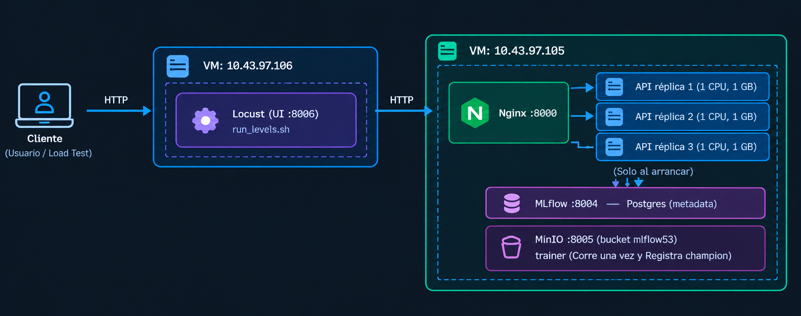
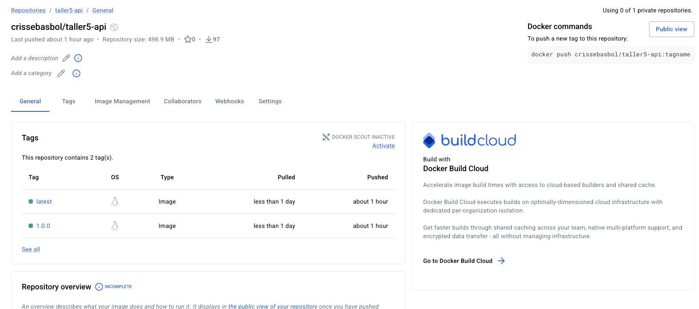
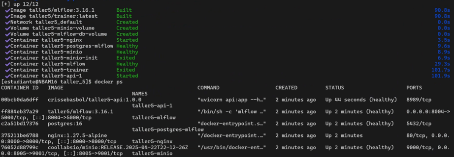
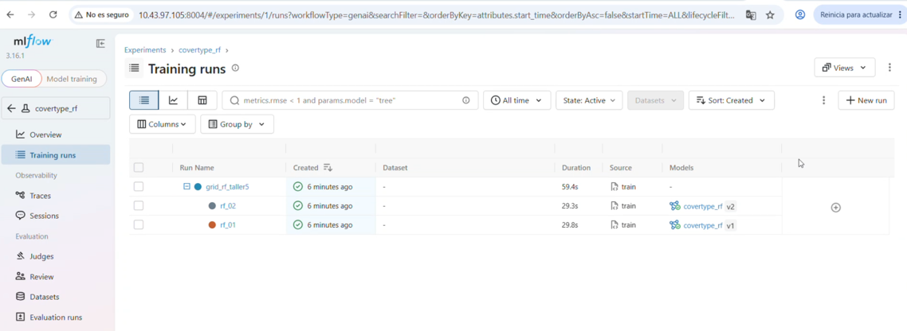
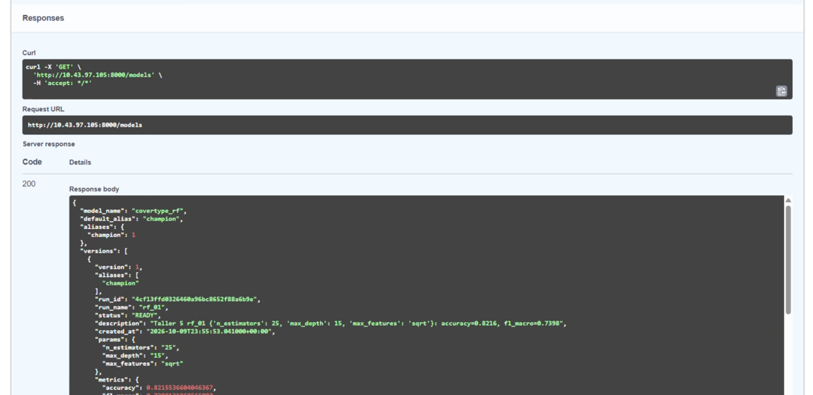
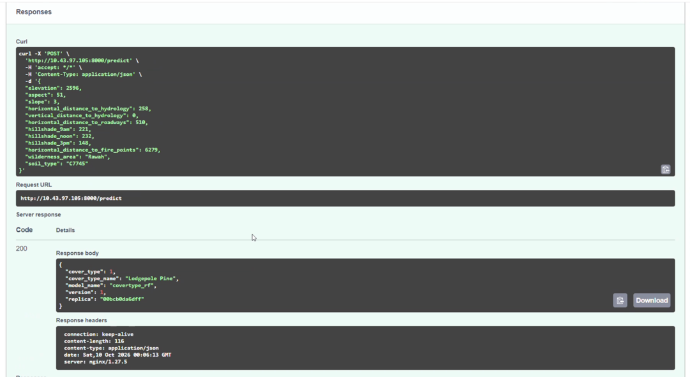
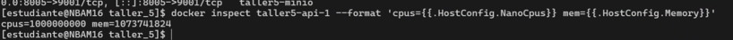
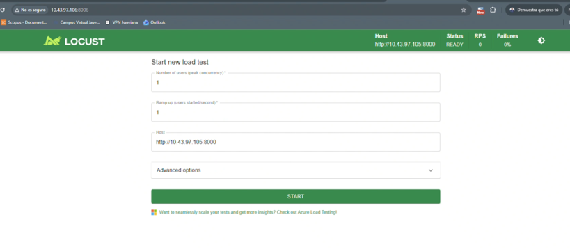

# Taller 5 - Pruebas de carga con Locust

Prueba de carga a una API de inferencia que sirve un modelo cargado desde
**MLflow**, para medir cuántos usuarios concurrentes soporta **una réplica**
limitada a **1 CPU y 1 GB** y cuánto cambia la capacidad con **tres réplicas**
detrás de **Nginx**. Se usa el dataset **Covertype** de taller4.

## Arquitectura

La API y todo lo que necesita corren en una VM; Locust corre en **otra VM**, así
la CPU que se gasta simulando usuarios no compite con la de la API.

 

Flujo:

1. `trainer` entrena dos Random Forest de Covertype, los registra en MLflow como
   versiones de `covertype_rf` y le pone el alias `champion` al mejor.
2. Cada réplica de la `api` descarga el `champion` **al arrancar** y lo deja en
   memoria. Durante la prueba `/predict` no llama a MLflow.
3. Nginx es la única entrada pública y reparte las peticiones entre réplicas.
4. Locust, desde la VM `.106`, genera la carga contra `http://10.43.97.105:8000`.

## Estructura

Cada carpeta es un servicio con su `docker-compose.yml` y su README. 
El `docker-compose.yml` de la raíz los une con `include`. 
Locust tiene su propio compose porque se ejecuta en otra VM.

## Paso a paso

### 1. Construir y publicar la imagen de la API en Docker Hub

```bash
docker login
docker buildx build --platform linux/amd64,linux/arm64 \
  -t crissebasbol/taller5-api:1.0.0 \
  -t crissebasbol/taller5-api:latest \
  --push api
```

En la siguiend imagen se ve la publicación en Docker Hub, con la etiqueta `1.0.0` y `latest`.


### 2. Levantar el stack con una réplica

```bash
cd taller_5
docker compose up -d --build --scale api=1
```

La primera vez el `trainer` tarda un par de minutos entrenando.

En la siguiente imagen se ve que la réplica `taller5-api-1` está `healthy`,
trainer se demoró un par de minutos y Nginx ya está listo para recibir peticiones.


### 3. Verificar que todo funciona

Modelo registrado en MLflow (http://10.43.97.105:8004):

A continuación se ve la interfaz web de MLflow mostrando las dos versiones del modelo `covertype_rf`


Versiones registradas, a través de la API:

```bash
curl http://10.43.97.105:8000/models
```

Llamando a este endpoint se obtiene un JSON con las dos versiones del modelo `covertype_rf`, sus métricas y cuál tiene el alias `champion`.
En la siguiente imagen se ve la salida de `GET /models` mostrando las dos versiones, sus métricas y cuál tiene el alias `champion`.


De igual manera si se llama al endpoint de predict usando nginx se obtiene un JSON con el `cover_type` predicho, la `version` del modelo y la `replica` que atendió la petición.


Límites aplicados a la réplica

```bash
docker inspect taller5-api-1 --format 'cpus={{.HostConfig.NanoCpus}} mem={{.HostConfig.Memory}}'
```


### 4. Preparar Locust

Comprobación de que la API responde

```bash
curl http://10.43.97.105:8000/health
```

Construir la imagen de Locust:

```bash
cd mlops-course/taller_5/locust
docker compose build
```
Para observar la UI de Locust:
```bash
docker compose up
```
En la siguiente imagen se ve la interfaz web de Locust mostrando los campos para configurar la prueba de carga, incluyendo el número de usuarios, la tasa de aparición y el host de la API.


### 5. Prueba con 1 réplica

Se usan dos terminales, una en cada VM, durante **toda** la sesión de pruebas:

- **VM (API):** `scripts/docker_stats.sh` toma una muestra de
  `docker stats` cada 2 s con su hora, y sigue hasta Ctrl+C.
- **VM (Locust):** `run_levels.sh` corre todos los niveles seguidos y
  anota en `resumen.csv` la hora de inicio y fin de la ventana estable de cada uno.

Al final, `scripts/stats_por_nivel.sh` cruza los dos archivos por hora y calcula
la CPU y la memoria de cada contenedor **solo dentro de la ventana de cada
nivel**. Así no hay que lanzar ni detener nada a mano entre niveles.

```text
(LOCUS)  run_levels.sh   |rampa|--- 50 usuarios ---|pausa|rampa|--- 100 ---|pausa| ...
(API)    docker_stats.sh  ·  ·  ·  ·  ·  ·  ·  ·  ·  ·  ·  ·  ·  ·  ·  ·  ·  ·  ·  ...  (Ctrl+C)
                              └ ventana 1 ┘                └ ventana 2 ┘
```

**1. VM (API): empezar a registrar** (desde `taller_5`):

```bash
./scripts/docker_stats.sh rep1
```

Guarda las muestras en `stats/rep1.csv` y se deja corriendo.

**2. VM (Locust): lanzar los niveles** (desde `taller_5/locust`):

```bash
./run_levels.sh 1 50 100 200 400 800
```

| Nivel | Rampa (20 usuarios/s) | Ventana medida | Pausa |
|---:|---:|---:|---:|
| 50 | 3 s | 120 s | 30 s |
| 100 | 5 s | 120 s | 30 s |
| 200 | 10 s | 120 s | 30 s |
| 400 | 20 s | 120 s | 30 s |
| 800 | 40 s | 120 s | 30 s |


**3. VM (API): detener el registro** con Ctrl+C cuando `run_levels.sh` termine.

**4. Cruzar por nivel.** Subir `resumen.csv` de la VM (Locust) a la VM (API) a github y
en la VM (API).

Muestra una fila por nivel y por contenedor y la guarda en
`stats/rep1_por_nivel.csv`:

Ya que estamos realizando un script para obtener métricas automatizadas, el reloj debe ser el mismo en ambas máquinas.
Si los relojes no coincidían, `OFFSET` es la diferencia en segundos

```bash
OFFSET=0 ./scripts/stats_por_nivel.sh stats/rep1.csv locust/resultados/resumen.csvv
```

TODO imagen: `images/08_rep1_run_levels.png` con la salida de `run_levels.sh`
para 1 réplica (tabla final de `resumen.csv`).

TODO imagen: `images/09_rep1_docker_stats.png` con la salida de
`stats_por_nivel.sh` para `stats/rep1.csv`, donde se vea la CPU de
`taller5-api-1` subiendo por nivel hasta ~100 % en el primero que no cumple.

TODO imagen: `images/10_rep1_locust_charts.png` con las gráficas de Locust
(RPS, tiempos de respuesta, usuarios) en el punto de saturación de 1 réplica.

### 6. Escalar a 3 réplicas (VM `.105`)

```bash
docker compose up -d --scale api=3
docker compose ps api
```

Nginx descubre las réplicas nuevas solo (vuelve a resolver `api` cada 5 s). Para
comprobar que reparte, se llama varias veces y el campo `replica` debe cambiar:

```bash
for i in $(seq 6); do curl -s http://10.43.97.105:8000/health; echo; done
```

TODO imagen: `images/11_docker_ps_3_replicas.png` con `taller5-api-1`,
`taller5-api-2` y `taller5-api-3` `healthy`, y la salida del `for` mostrando
tres `replica` distintas.

### 7. Prueba con 3 réplicas

Mismo procedimiento del paso 5, mismo `locustfile.py`, misma tasa de aparición,
misma ventana y mismo criterio. Solo cambian el nombre del registro y el primer
argumento de `run_levels.sh`:

```bash
# 1. VM .105 (se deja corriendo; Ctrl+C al final)
./scripts/docker_stats.sh rep3
# 2. VM .106
./run_levels.sh 3 200 400 600 800 1200
# (opcional) afinar alrededor del límite, sin detener docker_stats.sh
./run_levels.sh 3 <niveles intermedios>
# 3. VM .105: Ctrl+C en docker_stats.sh
# 4. VM .105: copiar de nuevo resumen.csv de la .106 y cruzar
./scripts/stats_por_nivel.sh stats/rep3.csv locust/resultados/resumen.csv
```

`resumen.csv` tiene ahora filas de 1 y de 3 réplicas. Esto no es problema: con
`stats/rep3.csv` solo coinciden las ventanas de las pruebas de 3 réplicas, y la
salida (`stats/rep3_por_nivel.csv`) trae una fila por réplica (`taller5-api-1`,
`-2`, `-3`), además de Nginx.

TODO imagen: `images/12_rep3_run_levels.png` con la salida de `run_levels.sh`
para 3 réplicas.

TODO imagen: `images/13_rep3_docker_stats.png` con la salida de
`stats_por_nivel.sh` para `stats/rep3.csv`, mostrando las tres réplicas y Nginx
en el nivel de saturación.

TODO imagen: `images/14_rep3_locust_charts.png` con las gráficas de Locust en el
punto de saturación de 3 réplicas.

TODO imagen: `images/15_locust_vm_cpu.png` con la CPU de la VM `.106` (por
ejemplo `stats/locust_rep3_u<max>.csv` o `htop`) en el nivel más alto, para
mostrar que el generador no era el límite.

### 8. Apagar

```bash
# VM .105
docker compose down
# Para borrar también los volúmenes (MLflow y MinIO):
docker compose down -v
```

## Resultados

Llenar con `locust/resultados/resumen.csv` (RPS, peticiones, fallos, p50, p95,
cumple), `stats/rep1_por_nivel.csv` y `stats/rep3_por_nivel.csv` (CPU y RAM de
la API y de Nginx en la `.105`: usar `cpu_prom_pct` y `mem_max_mib` de la ventana
de cada nivel) y `stats/locust_rep<N>_u<usuarios>.csv` (CPU de Locust en la
`.106`).

### 1 réplica (1 CPU, 1 GB)

| Usuarios | RPS | Peticiones | Fallos % | p50 (ms) | p95 (ms) | CPU API | RAM API | CPU Locust | Cumple |
|---:|---:|---:|---:|---:|---:|---:|---:|---:|:---:|
| 50 | | | | | | | | | |
| 100 | | | | | | | | | |
| 200 | | | | | | | | | |
| 400 | | | | | | | | | |
| 800 | | | | | | | | | |

### 3 réplicas (1 CPU, 1 GB cada una)

| Usuarios | RPS | Peticiones | Fallos % | p50 (ms) | p95 (ms) | CPU API (c/u) | RAM API (c/u) | CPU Nginx | CPU Locust | Cumple |
|---:|---:|---:|---:|---:|---:|---:|---:|---:|---:|:---:|
| 200 | | | | | | | | | | |
| 400 | | | | | | | | | | |
| 600 | | | | | | | | | | |
| 800 | | | | | | | | | | |
| 1200 | | | | | | | | | | |

### Comparación

| Métrica | 1 réplica | 3 réplicas | Cambio |
|---------|----------:|-----------:|-------:|
| Concurrencia máxima sostenible (usuarios) | TODO | TODO | TODO % |
| RPS en ese nivel | TODO | TODO | TODO % |
| p95 en ese nivel (ms) | TODO | TODO | |
| Primer nivel que no cumple | TODO | TODO | |

Cambio % = `(3 réplicas - 1 réplica) / 1 réplica × 100`. Un escalado perfecto
sería +200 % (3×).

## Preguntas

**¿Cuál es la concurrencia máxima sostenible y cuántos RPS procesa una réplica
limitada a 1 CPU y 1 GB?**

TODO: último nivel de la tabla de 1 réplica que cumple el criterio, con su RPS.

**¿Cuál es la concurrencia máxima sostenible y cuántos RPS procesan tres réplicas
con esos mismos límites por réplica?**

TODO: último nivel de la tabla de 3 réplicas que cumple el criterio, con su RPS.

**¿En qué porcentaje cambió la capacidad? ¿El aumento fue cercano a tres veces o
aparecieron otros cuellos de botella?**

TODO: usar la tabla de comparación. Si queda lejos de 3×, revisar qué se saturó
en la siguiente pregunta.

**¿Qué recurso se saturó primero y qué evidencia muestran `docker stats`, Locust
y la máquina generadora de carga?**

TODO. Lo que se espera ver si el límite es la API: la CPU de cada réplica llega a
~100 % (1 CPU) mientras la memoria queda muy por debajo de 1 GB; en Locust el RPS
deja de subir aunque aumenten los usuarios y el p95 crece de golpe; la CPU del
contenedor de Locust en `.106` queda lejos de su límite.

**¿Qué servicios adicionales (MLflow, base de datos o balanceador) pudieron
limitar el resultado?**

TODO. Puntos a revisar con la evidencia:

- **MLflow, MinIO y Postgres**: la API solo los usa al arrancar, así que durante
  la prueba su CPU debería quedarse en ~0 % (siempre que nadie llame
  `/models`, que sí consulta MLflow). Esta es la diferencia con taller4,
  donde cada `/predict` consultaba el alias en MLflow y MLflow habría sido el
  cuello de botella.
- **Nginx**: no tiene límite; revisar su CPU en `docker stats` con 3 réplicas.
- **La propia VM `.105`**: si tiene pocos núcleos, o si otro proceso los usa
  durante la prueba, tres réplicas de 1 CPU pueden no recibir 1 CPU completa cada
  una.
- **Locust y la red/VPN**: un solo proceso de Locust usa un núcleo; y la latencia
  entre `.106` y `.105` suma al p95.
