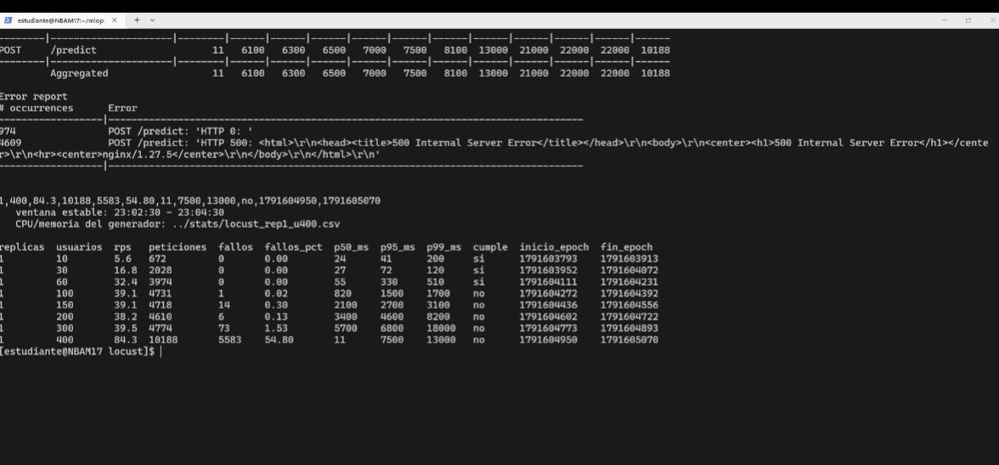
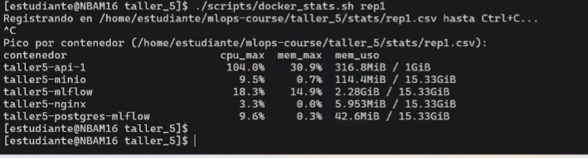
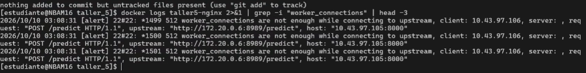
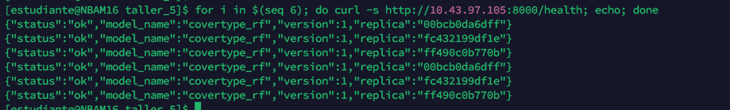

# Taller 5 - Pruebas de carga con Locust

Prueba de carga a una API de inferencia que sirve un modelo cargado desde
**MLflow**, para medir cuántos usuarios concurrentes soporta **una réplica**
limitada a **1 CPU y 1 GB** y cuánto cambia la capacidad con **tres réplicas**
detrás de **Nginx**. Se usa el dataset **Covertype** de taller4.

## Arquitectura

La API y todo lo que necesita corren en una VM; Locust corre en **otra VM**, así
la CPU que se gasta simulando usuarios no compite con la de la API.

 

Flujo:

1. `trainer` entrena dos Random Forest de Covertype, los registra en MLflow como
   versiones de `covertype_rf` y le pone el alias `champion` al mejor.
2. Cada réplica de la `api` descarga el `champion` **al arrancar** y lo deja en
   memoria. Durante la prueba `/predict` no llama a MLflow.
3. Nginx es la única entrada pública y reparte las peticiones entre réplicas.
4. Locust, desde la VM `.106`, genera la carga contra `http://10.43.97.105:8000`.

## Estructura

Cada carpeta es un servicio con su `docker-compose.yml` y su README. 
El `docker-compose.yml` de la raíz los une con `include`. 
Locust tiene su propio compose porque se ejecuta en otra VM.

## Paso a paso

### 1. Construir y publicar la imagen de la API en Docker Hub

```bash
docker login
docker buildx build --platform linux/amd64,linux/arm64 \
  -t crissebasbol/taller5-api:1.0.0 \
  -t crissebasbol/taller5-api:latest \
  --push api
```

En la siguiend imagen se ve la publicación en Docker Hub, con la etiqueta `1.0.0` y `latest`.


### 2. Levantar el stack con una réplica

```bash
cd taller_5
docker compose up -d --build --scale api=1
```

La primera vez el `trainer` tarda un par de minutos entrenando.

En la siguiente imagen se ve que la réplica `taller5-api-1` está `healthy`,
trainer se demoró un par de minutos y Nginx ya está listo para recibir peticiones.


### 3. Verificar que todo funciona

Modelo registrado en MLflow (http://10.43.97.105:8004):

A continuación se ve la interfaz web de MLflow mostrando las dos versiones del modelo `covertype_rf`


Versiones registradas, a través de la API:

```bash
curl http://10.43.97.105:8000/models
```

Llamando a este endpoint se obtiene un JSON con las dos versiones del modelo `covertype_rf`, sus métricas y cuál tiene el alias `champion`.
En la siguiente imagen se ve la salida de `GET /models` mostrando las dos versiones, sus métricas y cuál tiene el alias `champion`.


De igual manera si se llama al endpoint de predict usando nginx se obtiene un JSON con el `cover_type` predicho, la `version` del modelo y la `replica` que atendió la petición.


Límites aplicados a la réplica

```bash
docker inspect taller5-api-1 --format 'cpus={{.HostConfig.NanoCpus}} mem={{.HostConfig.Memory}}'
```


### 4. Preparar Locust

Comprobación de que la API responde

```bash
curl http://10.43.97.105:8000/health
```

Construir la imagen de Locust:

```bash
cd mlops-course/taller_5/locust
docker compose build
```
Para observar la UI de Locust:
```bash
docker compose up
```
En la siguiente imagen se ve la interfaz web de Locust mostrando los campos para configurar la prueba de carga, incluyendo el número de usuarios, la tasa de aparición y el host de la API.


### 5. Prueba con 1 réplica

Se usan dos terminales, una en cada VM, durante **toda** la sesión de pruebas:

- **VM (API):** `scripts/docker_stats.sh` toma una muestra de
  `docker stats` cada 2 s con su hora, y sigue hasta Ctrl+C.
- **VM (Locust):** `run_levels.sh` corre todos los niveles seguidos y
  anota en `resumen.csv` la hora de inicio y fin de la ventana estable de cada uno.

Al final, `scripts/stats_por_nivel.sh` cruza los dos archivos por hora y calcula
la CPU y la memoria de cada contenedor **solo dentro de la ventana de cada
nivel**. Así no hay que lanzar ni detener nada a mano entre niveles.

```text
(LOCUS)  run_levels.sh   |rampa|--- 10 usuarios ---|pausa|rampa|--- 30 ----|pausa| ...
(API)    docker_stats.sh  ·  ·  ·  ·  ·  ·  ·  ·  ·  ·  ·  ·  ·  ·  ·  ·  ·  ·  ·  ...  (Ctrl+C)
                              └ ventana 1 ┘                └ ventana 2 ┘
```

**1. VM (API): Empezar a registrar:***

```bash
./scripts/docker_stats.sh rep1
```

Guarda las muestras en `stats/rep1.csv` y se deja corriendo.

**2. VM (Locust): lanzar los niveles**:

```bash
./run_levels.sh 1 10 30 60 100 150 200 300 400
```

Se usan **los mismos niveles en la prueba de 1 y de 3 réplicas**, para poder
comparar nivel por nivel. La lista cubre las dos zonas donde se espera el límite:
una réplica atiende unos 39 RPS (unos 60-80 usuarios con `wait_time` de 1 a
2.5 s) y tres réplicas unos 117 RPS (unos 200 usuarios). Los niveles más altos
muestran la saturación de cada configuración.

| Nivel | Rampa (20 usuarios/s) | Ventana medida | Pausa |
|---:|---:|---:|---:|
| 10 | 1 s | 120 s | 30 s |
| 30 | 2 s | 120 s | 30 s |
| 60 | 3 s | 120 s | 30 s |
| 100 | 5 s | 120 s | 30 s |
| 150 | 8 s | 120 s | 30 s |
| 200 | 10 s | 120 s | 30 s |
| 300 | 15 s | 120 s | 30 s |
| 400 | 20 s | 120 s | 30 s |

En total tarda unos 21 minutos. Si ya existe un `resumen.csv` de una versión
anterior del script (sin `inicio_epoch` ni `fin_epoch`), `run_levels.sh` se
detiene y pide moverlo o borrarlo.


**3. VM (API): detener el registro** con Ctrl+C cuando `run_levels.sh` termine.

**4. Cruzar por nivel.** Subir `resumen.csv` de la VM (Locust) a la VM (API) a github y
en la VM (API).

Muestra una fila por nivel y por contenedor y la guarda en
`stats/rep1_por_nivel.csv`:

Ya que estamos realizando un script para obtener métricas automatizadas, el reloj debe ser el mismo en ambas máquinas.
Si los relojes no coincidían, `OFFSET` es la diferencia en segundos

```bash
OFFSET=0 ./scripts/stats_por_nivel.sh stats/rep1.csv locust/resultados/resumen.csv
```

Salida final de `run_levels.sh` con 1 réplica (VM Locust). Desde 100 usuarios el
RPS se queda en ~39 y el p95 se dispara. En 400 aparecen los `500` de Nginx:



Pico de toda la sesión al detener `docker_stats.sh` (VM API). `taller5-api-1`
llega a 104 % de CPU (1 CPU completa) con solo 317 MiB de memoria:



Log de Nginx durante los niveles de 300 y 400 usuarios: se quedó sin conexiones
con su límite por defecto de 512:



El detalle por nivel (salida de `stats_por_nivel.sh`, en
`stats/rep1_por_nivel.csv`) está en [Resultados](#1-réplica-1-cpu-1-gb).

### 6. Escalar a 3 réplicas

Antes de escalar se sube el límite de conexiones de Nginx (de 512 a 4096 por
proceso, ver [nginx/README.md](nginx/README.md)). En la prueba de 1 réplica, con
300 y 400 usuarios, Nginx se quedó sin conexiones y respondió `500`. Con 3
réplicas pasaría justo en la zona donde se espera el límite.

Se prosigue incrementando el número de réplicas a 3:

```bash
docker compose up -d --scale api=3
docker compose ps api
```

Es importante comprobar que las tres instancias estén respondiendo:



### 7. Prueba con 3 réplicas

Mismo procedimiento del paso 5, mismo `locustfile.py`, misma tasa de aparición,
misma ventana y mismo criterio. Solo cambian el nombre del registro y el primer
argumento de `run_levels.sh`:

```bash
./scripts/docker_stats.sh rep3
./run_levels.sh 3 10 30 60 100 150 200 300 400
```

`resumen.csv` tiene ahora filas de 1 y de 3 réplicas. Esto no es problema: con
`stats/rep3.csv` solo coinciden las ventanas de las pruebas de 3 réplicas, y la
salida (`stats/rep3_por_nivel.csv`) trae una fila por réplica (`taller5-api-1`,
`-2`, `-3`), además de Nginx.

TODO imagen: `images/12_rep3_run_levels.png` con la salida de `run_levels.sh`
para 3 réplicas.

TODO imagen: `images/13_rep3_docker_stats.png` con la salida de
`stats_por_nivel.sh` para `stats/rep3.csv`, mostrando las tres réplicas y Nginx
en el nivel de saturación.

TODO imagen: `images/14_rep3_locust_charts.png` con las gráficas de Locust en el
punto de saturación de 3 réplicas.

TODO imagen: `images/15_locust_vm_cpu.png` con la CPU de la VM `.106` (por
ejemplo `stats/locust_rep3_u<max>.csv` o `htop`) en el nivel más alto, para
mostrar que el generador no era el límite.

### 8. Apagar

```bash
# VM .105
docker compose down
# Para borrar también los volúmenes (MLflow y MinIO):
docker compose down -v
```

## Resultados

Llenar con `locust/resultados/resumen.csv` (RPS, peticiones, fallos, p50, p95,
cumple), `stats/rep1_por_nivel.csv` y `stats/rep3_por_nivel.csv` (CPU y RAM de
la API y de Nginx en la `.105`: usar `cpu_prom_pct` y `mem_max_mib` de la ventana
de cada nivel) y `stats/locust_rep<N>_u<usuarios>.csv` (CPU de Locust en la
`.106`).

### 1 réplica (1 CPU, 1 GB)

| Usuarios | RPS | Peticiones | Fallos % | p50 (ms) | p95 (ms) | CPU API prom / máx | RAM API máx | CPU Locust prom / máx | Cumple |
|---:|---:|---:|---:|---:|---:|---:|---:|---:|:---:|
| 10 | 5.6 | 672 | 0.00 | 24 | 41 | 11 % / 27 % | 304 MiB | 3 % / 20 % | sí |
| 30 | 16.8 | 2028 | 0.00 | 27 | 72 | 33 % / 49 % | 312 MiB | 8 % / 16 % | sí |
| **60** | **32.4** | 3974 | 0.00 | 55 | **330** | 72 % / 100 % | 304 MiB | 13 % / 22 % | **sí** |
| 100 | 39.1 | 4731 | 0.02 | 820 | 1500 | 96 % / 102 % | 316 MiB | 15 % / 25 % | no |
| 150 | 39.1 | 4718 | 0.30 | 2100 | 2700 | 101 % / 102 % | 316 MiB | 16 % / 28 % | no |
| 200 | 38.2 | 4610 | 0.13 | 3400 | 4600 | 101 % / 102 % | 316 MiB | 15 % / 37 % | no |
| 300 \* | 39.5 | 4774 | 1.53 | 5700 | 6800 | 101 % / 104 % | 316 MiB | 20 % / 35 % | no |
| 400 \* | 84.3 | 10188 | 54.80 | 11 | 7500 | 100 % / 103 % | 317 MiB | 36 % / 42 % | no |

Fuentes:
- **RPS a p95:** `locust/resultados/resumen.csv`.
- **CPU y RAM de la API:** `stats/rep1_por_nivel.csv`, solo con las muestras de la ventana estable de cada nivel.
- **CPU de Locust:** `stats/locust_rep1_u<usuarios>.csv`. Solo cuenta el contenedor de la prueba (`taller5-locust-locust-run-*`) y no la primera muestra, porque ese ~99 % es Python cargando Locust al arrancar. El contenedor de la UI (`taller5-locust`) también aparece en esos archivos, pero estuvo en reposo (0 %).

**Lectura:**

- **Techo de ~39 RPS.** De 100 a 300 usuarios el RPS queda entre 38 y 39.5,
  aunque los usuarios se tripliquen; lo único que crece es la espera (p50 de
  820 ms a 5700 ms). Una petición sin cola tarda ~25 ms, o sea que 1 CPU atiende
  ~40 por segundo, y eso coincide con el techo.
- **Concurrencia máxima sostenible: 60 usuarios, 32.4 RPS, p95 de 330 ms.** En
  100 usuarios la demanda (~57 RPS) ya pasa el techo y el p95 sube a 1500 ms.
  El límite real está entre 60 y 100 usuarios.
- **Lo que se satura es la CPU.** El promedio de la API pasa de 11 % (10
  usuarios) a 72 % (60) y queda en ~100 % (1 CPU completa) desde 100 usuarios.
  La memoria se mantiene entre 300 y 317 MiB en todos los niveles: el modelo ya
  está cargado y la carga no la cambia. Usa el 31 % de 1 GiB.
- **El generador no fue el límite.** Locust no pasó de 42 % de CPU en ningún
  nivel.
- **Fallos de 100 a 200 usuarios.** Hubo entre 1 y 14 respuestas `502 Bad
  Gateway` de Nginx por nivel (0.02 % a 0.30 %). Son pocas y no cambian el
  resultado: el criterio falla por el p95, no por los fallos.

Uso de los demás servicios en la ventana de cada nivel (`stats/rep1_por_nivel.csv`):

| Usuarios | MLflow CPU prom / máx | MinIO CPU prom | Postgres CPU prom | Nginx CPU prom / máx | Nginx RAM |
|---:|---:|---:|---:|---:|---:|
| 10 | 3.4 % / 15.5 % | 1.1 % | 1.1 % | 0.2 % / 0.3 % | 2 MiB |
| 60 | 3.5 % / 15.6 % | 0.9 % | 1.2 % | 1.3 % / 1.8 % | 3 MiB |
| 100 | 2.3 % / 8.4 % | 1.2 % | 0.8 % | 1.2 % / 1.7 % | 3 MiB |
| 200 | 3.0 % / 18.3 % | 0.1 % | 1.1 % | 1.1 % / 1.5 % | 5 MiB |
| 400 | 3.7 % / 16.7 % | 0.8 % | 0.7 % | 2.6 % / 3.3 % | 6 MiB |

MLflow, MinIO y Postgres consumen lo mismo con 10 que con 400 usuarios (MLflow
~3 % con picos de ~16 %, que son tareas propias de su servidor). Esto confirma
que `/predict` no los usa. MLflow ocupa 2.3 GB de RAM, pero quieto.

\* Con 300 y 400 usuarios Nginx tenía todavía el límite por defecto de 512
conexiones y se quedó sin conexiones (`512 worker_connections are not enough`).
En 400, 4609 peticiones recibieron `500` de Nginx y 974 fallaron al conectar
(`HTTP 0`), sin llegar a la API. Las respuestas rápidas de esos errores
(p50 11 ms) son las que suben el RPS a 84. Estos dos niveles miden el
balanceador, no la réplica. La capacidad de 1 réplica sale de los niveles de 10
a 200, donde Nginx no llegó a su límite. Para la prueba de 3 réplicas se subió el
límite (paso 6).

### 3 réplicas (1 CPU, 1 GB cada una)

| Usuarios | RPS | Peticiones | Fallos % | p50 (ms) | p95 (ms) | CPU API (c/u) | RAM API (c/u) | CPU Nginx | CPU Locust | Cumple |
|---:|---:|---:|---:|---:|---:|---:|---:|---:|---:|:---:|
| 10 | | | | | | | | | | |
| 30 | | | | | | | | | | |
| 60 | | | | | | | | | | |
| 100 | | | | | | | | | | |
| 150 | | | | | | | | | | |
| 200 | | | | | | | | | | |
| 300 | | | | | | | | | | |
| 400 | | | | | | | | | | |

### Comparación por nivel

Mismos niveles en las dos pruebas:

| Usuarios | RPS 1 réplica | RPS 3 réplicas | p95 1 réplica (ms) | p95 3 réplicas (ms) | Cumple 1 | Cumple 3 |
|---:|---:|---:|---:|---:|:---:|:---:|
| 10 | 5.6 | | 41 | | sí | |
| 30 | 16.8 | | 72 | | sí | |
| 60 | 32.4 | | 330 | | sí | |
| 100 | 39.1 | | 1500 | | no | |
| 150 | 39.1 | | 2700 | | no | |
| 200 | 38.2 | | 4600 | | no | |
| 300 \* | 39.5 | | 6800 | | no | |
| 400 \* | 84.3 | | 7500 | | no | |

\* En 1 réplica, afectado por el límite de 512 conexiones de Nginx (ver arriba).
Comparar estos dos niveles con cuidado.

Mientras ninguna configuración está saturada, el RPS debería ser casi igual en
las dos (lo fija `wait_time`, no la API). La diferencia aparece cuando la de 1
réplica se queda en su techo y la de 3 sigue subiendo.

### Comparación de capacidad

| Métrica | 1 réplica | 3 réplicas | Cambio |
|---------|----------:|-----------:|-------:|
| Concurrencia máxima sostenible (usuarios) | 60 | TODO | TODO % |
| RPS en ese nivel | 32.4 | TODO | TODO % |
| p95 en ese nivel (ms) | 330 | TODO | |
| Primer nivel que no cumple | 100 | TODO | |
| Techo de RPS (niveles saturados) | ~39 | TODO | TODO % |

Cambio % = `(3 réplicas - 1 réplica) / 1 réplica × 100`. Un escalado perfecto
sería +200 % (3×).

## Preguntas

**¿Cuál es la concurrencia máxima sostenible y cuántos RPS procesa una réplica
limitada a 1 CPU y 1 GB?**

**60 usuarios concurrentes, con 32.4 RPS** (p95 de 330 ms, 0 % de fallos). Es el
último nivel que cumple el criterio. En el siguiente nivel probado, 100
usuarios, el p95 sube a 1500 ms, así que el límite exacto está entre 60 y 100
usuarios. La réplica no procesa más de **~39 RPS**: ese valor se mantiene de 100
a 300 usuarios.

**¿Cuál es la concurrencia máxima sostenible y cuántos RPS procesan tres réplicas
con esos mismos límites por réplica?**

TODO: último nivel de la tabla de 3 réplicas que cumple el criterio, con su RPS.

**¿En qué porcentaje cambió la capacidad? ¿El aumento fue cercano a tres veces o
aparecieron otros cuellos de botella?**

TODO: usar la tabla de comparación. Si queda lejos de 3×, revisar qué se saturó
en la siguiente pregunta.

**¿Qué recurso se saturó primero y qué evidencia muestran `docker stats`, Locust
y la máquina generadora de carga?**

**Con 1 réplica, la CPU de la API.** Las tres fuentes coinciden:

- **`docker stats`** (`stats/rep1_por_nivel.csv`): la CPU promedio de
  `taller5-api-1` sube con la carga (11 % → 33 % → 72 %) y desde 100 usuarios
  queda en ~100 %, que es su límite de 1 CPU. La memoria se mantiene en ~310 MiB
  de 1 GiB en todos los niveles: no está ni cerca de su límite.
- **Locust** (`resumen.csv`): desde 100 usuarios el RPS deja de subir (~39) aunque
  aumenten los usuarios, y lo que crece es la latencia (p95 de 330 ms a
  1500, 2700, 4600 ms). Es lo que pasa cuando el servidor ya está al máximo y las
  peticiones hacen fila.
- **Máquina generadora** (`stats/locust_rep1_u*.csv`): Locust usó como máximo
  42 % de CPU, así que el límite medido no es el del generador.

TODO: completar con la prueba de 3 réplicas.

**¿Qué servicios adicionales (MLflow, base de datos o balanceador) pudieron
limitar el resultado?**

TODO. Puntos a revisar con la evidencia:

- **MLflow, MinIO y Postgres**: no limitaron. La API solo los usa al arrancar,
  para descargar el modelo. En la prueba de 1 réplica su CPU fue la misma con 10
  que con 400 usuarios: MLflow ~3 % (picos de ~16 % propios de su servidor),
  MinIO y Postgres ~1 % (tabla en Resultados). Esta es la diferencia con
  taller4, donde cada `/predict` consultaba el alias en MLflow y MLflow habría
  sido el cuello de botella. Sí ocupan memoria de la VM: MLflow 2.3 GB.
- **Nginx**: sí limitó el resultado en la prueba de 1 réplica. Con su
  configuración por defecto (`events {}`: 1 proceso y 512 conexiones) se quedó
  sin conexiones con 300 y 400 usuarios y respondió `500` sin pasar las
  peticiones a la API. El log lo muestra
  (`512 worker_connections are not enough while connecting to upstream`), y se
  nota en Locust: en 400 usuarios el RPS sube a 84 con 54.8 % de fallos, cuando
  la réplica no pasa de ~39 RPS. Antes de la prueba de 3 réplicas se subió a
  `worker_processes auto` y `worker_connections 4096`. Con 3 réplicas revisar
  también su CPU en `stats/rep3_por_nivel.csv`.
- **La propia VM `.105`**: si tiene pocos núcleos, o si otro proceso los usa
  durante la prueba, tres réplicas de 1 CPU pueden no recibir 1 CPU completa cada
  una.
- **Locust y la red/VPN**: un solo proceso de Locust usa un núcleo; y la latencia
  entre `.106` y `.105` suma al p95.
